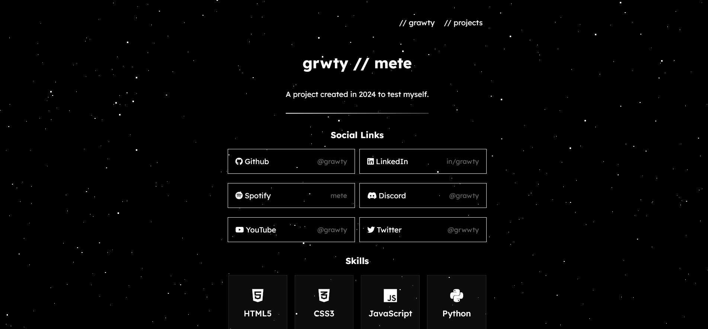

# dev-portfolio

This is a simple developer-style portfolio website I built while learning HTML and CSS.

I wanted to practice layout structure, basic styling, and organizing a small project properly.
Nothing fancy — just a clean and minimal personal page.

## Built with
- HTML
- CSS
- JavaScript

## Preview

> This project reflects my early stage in front-end development.
